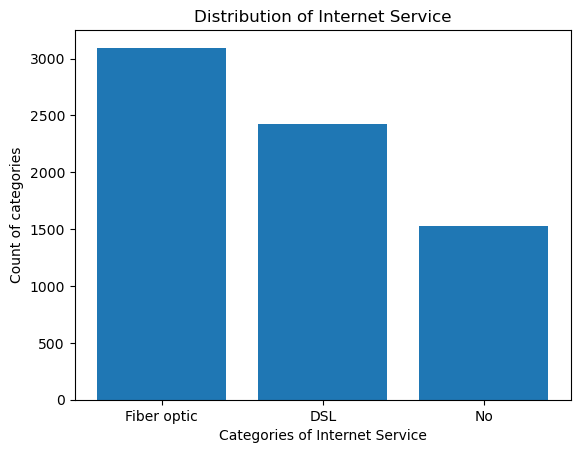
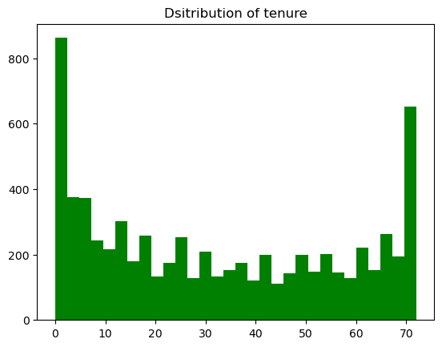

# Customer Churn Analysis & Prediction

This project explores and models **customer churn** data to identify patterns, visualize trends, and predict churn using various machine learning models.

---

## 📂 Dataset
- **File:** `customer_churn.csv`
- Contains customer demographic, service usage, and billing details.
- **Target variable:** `Churn` (Yes / No)

---

## 📊 Data Exploration

### 1. Data Inspection
- Previewed dataset with `.head()`
- Checked column info and datatypes using `.info()`
- Selected specific customers based on criteria:
  - Senior male customers using **Electronic check**
  - Customers with tenure > 70 months or MonthlyCharges > 100
  - Two-year contract, payment by Mailed check, and churned
  - Random sampling (`.sample()`)

### 2. Data Distribution
- Count of churn values (`.value_counts()`)

---

## 📈 Data Visualization

The following visualizations help us understand customer patterns.

### Internet Service Distribution


### Tenure Distribution


### Tenure vs Monthly Charges


### Contract vs Tenure


---

## 🤖 Machine Learning Models

### 1. **Linear Regression**
- **Goal:** Predict `MonthlyCharges` based on `tenure`
- Train-test split (70/30)
- Evaluation: RMSE using `mean_squared_error`

### 2. **Logistic Regression**
- **Goal:** Predict churn
- Features tested:
  - Single feature: `MonthlyCharges`
  - Multiple features: `tenure`, `MonthlyCharges`
- Metrics: Accuracy score, Confusion matrix

### 3. **Decision Tree Classifier**
- **Goal:** Predict churn from `tenure`
- Metrics: Accuracy score, Confusion matrix

### 4. **Random Forest Classifier**
- **Goal:** Predict churn from `tenure` and `MonthlyCharges`
- Metrics: Accuracy score, Confusion matrix

---

## 📦 Libraries Used
- **Pandas** – data handling
- **NumPy** – numerical operations
- **Matplotlib** – visualizations
- **Seaborn** – enhanced plotting
- **Scikit-learn** – machine learning models & metrics

---

## 🚀 How to Run
1. Install dependencies:
```bash
   pip install pandas numpy matplotlib seaborn scikit-learn
```
2. Place customer_churn.csv in the same directory as the script.

---

## 📜 Results Summary
- Linear Regression: RMSE score obtained = 29.45
- Logistic Regression: Basic churn classification with accuracy of 79.20.
- Decision Tree: Captured simple churn rules from tenure. accuracy = 74.52
- Random Forest: accuracy = 74.45

---

## 📝 Notes
- This is a basic churn analysis; feature engineering and hyperparameter tuning can further improve results.
- Encoding categorical variables and scaling features can enhance model performance.